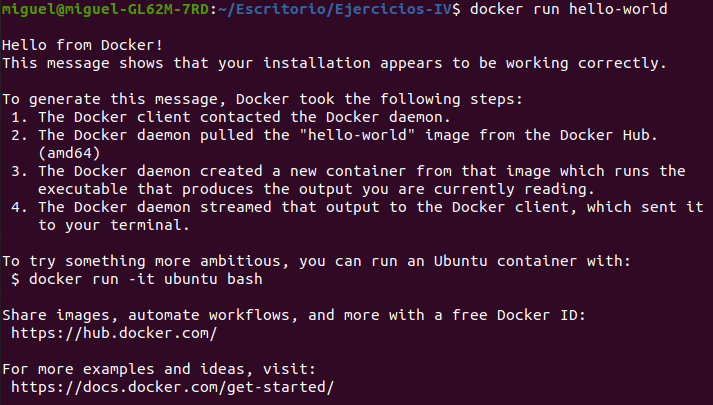
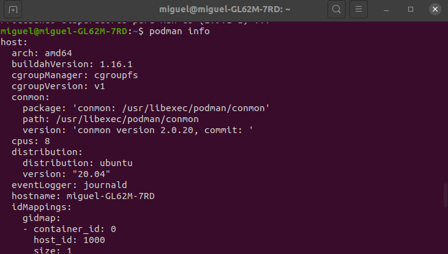
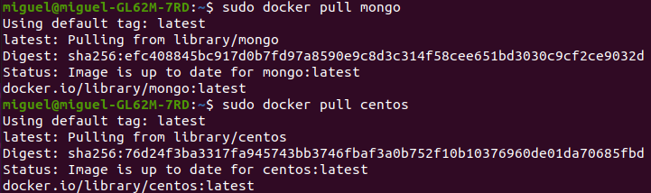
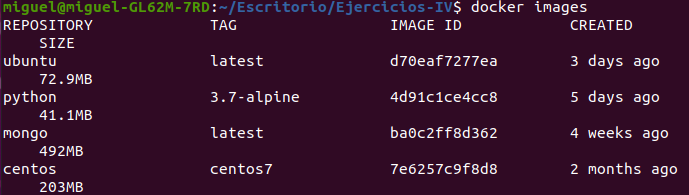

# Virtualización ligera usando contenedores

## Ejercicio 1: Instalar docker y/o otro gestor de contenedores como Podman/Buildah.

Docker ya lo tenía instalado porque hace falta para DAI, de todos modos, la forma de instalarlo es la que viene en la [documentación](https://docs.docker.com/engine/install/ubuntu/):
~~~
$ sudo apt-get update
$ sudo apt-get install docker-ce docker-ce-cli containerd.io
$ apt-cache madison docker-ce
$ sudo apt-get install docker-ce=<VERSION_STRING> docker-ce-cli=<VERSION_STRING> containerd.io
~~~ 

Para instalar podman he seguido los siguientes [pasos](https://computingforgeeks.com/how-to-install-podman-on-ubuntu/):
~~~
$ . /etc/os-release
$ echo "deb https://download.opensuse.org/repositories/devel:/kubic:/libcontainers:/stable/xUbuntu_${VERSION_ID}/ /" | sudo tee /etc/apt/sources.list.d/devel:kubic:libcontainers:stable.list
$ curl -L https://download.opensuse.org/repositories/devel:/kubic:/libcontainers:/stable/xUbuntu_${VERSION_ID}/Release.key | sudo apt-key add -
$ sudo apt update
$ sudo apt -y install podman
~~~

## Ejercicios 2:
### 1: Instalar a partir de docker una imagen alternativa de Ubuntu y alguna adicional, por ejemplo de CentOS.  

Para esto usamos el siguiente comando:

~~~
$ docker pull centos
~~~

### 2: Buscar e instalar una imagen que incluya MongoDB.

Instalamos MongoBD con:

~~~
$ docker pull mongo
~~~

## Ejercicio 3: Crear un usuario propio e instalar alguna aplicación tal como nginx en el contenedor creado de esta forma, usando las órdenes propias del sistema operativo con el que se haya inicializado el contenedor.

Primero ejecutamos la imagen de CentOs con:
~~~
$ docker run -it centos:centos7
~~~
Ahora creamos un nuevo usuario:

Instalamos nginx en la imagen de centos con los siguientes comandos:

~~~
$ sudo yum install epel-release
$ sudo yum install nginx
~~~

