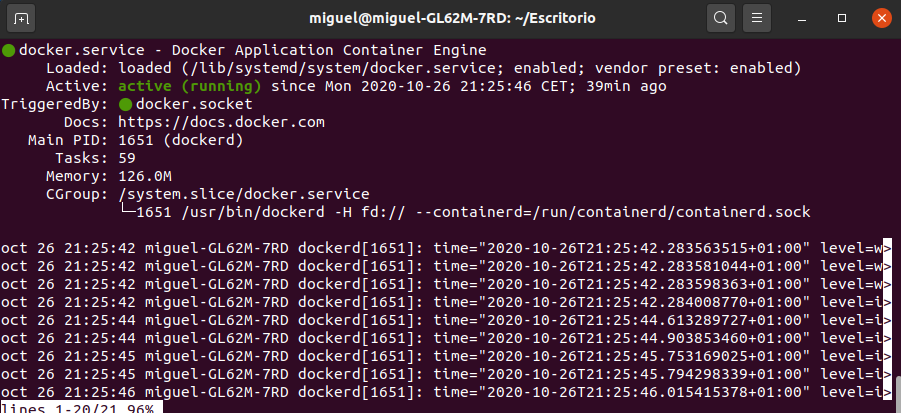

# Virtualización ligera usando contenedores

## Ejercicio 1: Instalar docker y/o otro gestor de contenedores como Podman/Buildah.

Docker ya lo tenía instalado porque hace falta para DAI, de todos modos, la forma de instalarlo es la que viene en la [documentación](https://docs.docker.com/engine/install/ubuntu/):
~~~
$ sudo apt-get update
$ sudo apt-get install docker-ce docker-ce-cli containerd.io
$ apt-cache madison docker-ce
$ sudo apt-get install docker-ce=<VERSION_STRING> docker-ce-cli=<VERSION_STRING> containerd.io
~~~ 

Para instalar podman he seguido los siguientes [pasos](https://computingforgeeks.com/how-to-install-podman-on-ubuntu/):
~~~
$ . /etc/os-release
$ echo "deb https://download.opensuse.org/repositories/devel:/kubic:/libcontainers:/stable/xUbuntu_${VERSION_ID}/ /" | sudo tee /etc/apt/sources.list.d/devel:kubic:libcontainers:stable.list
$ curl -L https://download.opensuse.org/repositories/devel:/kubic:/libcontainers:/stable/xUbuntu_${VERSION_ID}/Release.key | sudo apt-key add -
$ sudo apt update
$ sudo apt -y install podman
~~~

