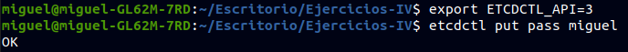
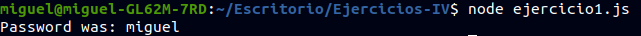
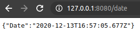
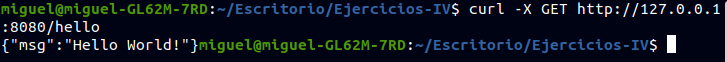
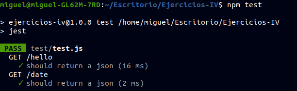
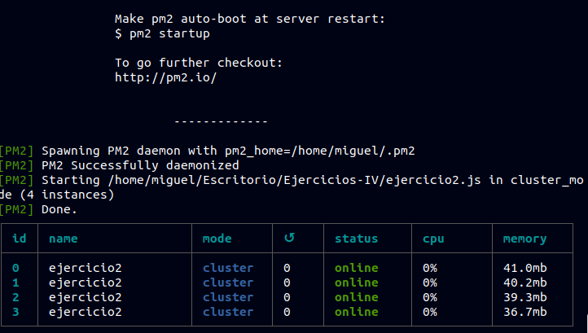

# EJERCICIOS DE MICROSERVICIOS

### Ejercicio 1:Instalar etcd3, averiguar qué bibliotecas funcionan bien con el lenguaje que estemos escribiendo el proyecto (u otro lenguaje), y hacer un pequeño ejemplo de almacenamiento y recuperación de una clave; hacer el almacenamiento desde la línea de órdenes (con etcdctl) y la recuperación desde el mini-programa que hagáis.

Instalamos etcd3 con `apt install etcd`, una vez instalado ya lo podemos añadir a nuestro proyecto con `npm i --save-dev etcd3`

Exportamos la clave que vamos a utilizar:



Este es el código del ejercicio, viene en la documentación oficial.
```
const { Etcd3 } = require('etcd3');
const client = new Etcd3();

(async () => {
  const passValue = await client.get('pass').string();
  console.log('Password was:', passValue);

  await client.delete().all();
})();

```

Lo ejecutamos y vemos el resultado:



### Ejercicio 2:Realizar una aplicación básica que use express para devolver alguna estructura de datos del modelo que se viene usando en el curso. Ejercicio3:Programar un microservicio en express (o el lenguaje y marco elegido) que incluya variables como en el caso anterior.

Instalamos express con `npm i express --save`

```
const express = require('express')
const app = express()
const port = process.env.port || 8080

app.get('/', function (req, res) {
    res.send( { status: 200 } );
});

app.get('/hello', function(req,res){
  res.send({msg: "Hello World!"})
});

app.get('/date', function (req, res) {
    var d = new Date();
    res.send( { 'Date': d} );
});

app.listen(port);
console.log('Server running at http://127.0.0.1:'+port+'/');

module.exports = app

```

Ejecutamos el código y vemos los resultados.






### Ejercicio 4:Crear pruebas para las diferentes rutas de la aplicación.

```
const request = require('supertest');
const app = require("../ejercicio2.js")

describe("GET /hello", function(){
  it("should return a json", function(done){
    request(app)
    .get('/hello')
    .expect('Content-Type', /json/)
    .expect(200,done)
  });
});

describe("GET /date", function(){
  it("should return a json", function(done){
    request(app)
    .get('/date')
    .expect('Content-Type', /json/)
    .expect(200,done)
  });
});

```


### Ejercicio 5: Experimentar con diferentes gestores de procesos y servidores web front-end para un microservicio que se haya hecho con antelación, por ejemplo en la sección anterior.

Instalamos pm2 `npm install pm2@latest -g`.
Y lo iniciamos `pm2 start ejercicio2.js -i 4`



### Ejercicio 6: Usar rake, invoke o la herramienta equivalente en tu lenguaje de programación para programar diferentes tareas que se puedan lanzar fácilmente desde la línea de órdenes.

En package.json añadimos lo siguiente en el apartado `scripts`

```
"start": "pm2 start ejercicio2.js -i 4",
"stop": "pm2 stop all"

```
