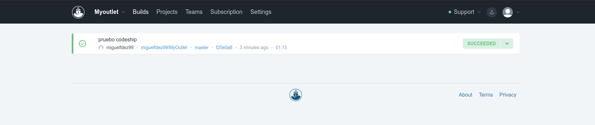

# Ejercicio 1: Darse de alta en algún servicio PaaS tal como Heroku o BlueMix o usar alguno de los PaaS de otros servicios cloud en los que ya se esté dado de alta.

Ya tenía una cuenta en Heroku

# Ejercicio 2:Crear una aplicación en OpenShift o en algún otro PaaS en el que se haya dado uno de alta. Realizar un despliegue de prueba usando alguno de los ejemplos incluidos con el PaaS.

Esta es una de las aplicaciones que tenía de prueba, un to do list.

# Ejercicio 3: Instalar y echar a andar tu primera aplicación en Heroku.

Ya se ha cumplido esta tarea.

# Ejercicio 4: Usar como base la aplicación de ejemplo de heroku y combinarla con la aplicación en node que se ha creado anteriormente. Probarla de forma local con foreman. Al final de cada modificación, los tests tendrán que funcionar correctamente; cuando se pasen los tests, se puede volver a desplegar en heroku.

Puede iniciarse con `foreman start` o con `nf start`.

# Ejercicio 5: Haz alguna modificación a tu aplicación en node.js para Heroku, sin olvidar añadir los tests para la nueva funcionalidad, y configura el despliegue automático a Heroku usando algún servicio de los mencionados en StackOverflow.

Snap CI ya no está disponible, por eso he utilizado Codeship

# Ejercicio 6: Preparar la aplicación con la que se ha venido trabajando hasta este momento para ejecutarse en un PaaS, el que se haya elegido.

Despliegue de la aplicación MyOutlet.

