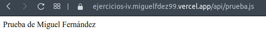
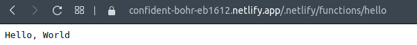

# Serverless

### Ejercicio 1:Darse de alta en Vercel y Firebase, y descargarse los SDKs para poder trabajar con ellos localmente.

Para darse de alta en Vercel solo hay que entrar con la cuenta de GitHub, en Firebase hay que entrar con una cuenta de Google.

Para descargarlos hay que ejecutar los siguientes comandos:

~~~
$ npm install -g vercel
$ npm install -g firebase-tools
~~~

### Ejercicio 2: Tomar alguna de las funciones de prueba de Vercel, y hacer despliegues de prueba con el mismo.

En la página de [Vercel](https://vercel.com/docs/serverless-functions/introduction) podemos ver ejemplos de como se utiliza. Voy a utilizar el siguiente código para mi función.

~~~
module.exports = (req,res) => {
  const { nombre = 'Miguel Fernández'} = req.query
  res.status(200).send(`Prueba de ${nombre} `)
};
~~~

Y vemos que funciona correctamente.

### Ejercicio 3: Tomar alguna de las funciones de prueba de Netlify, y hacer despliegues de prueba con el mismo.

Nos damos de alta en Netlify con nuestra cuenta de GitHub, y en este [enlace](https://functions-playground.netlify.app) podemos observar como de manera sencilla se puede lanzar una función de ejemplo de Netlify, seguimos los pasos de [aquí también](https://github.com/miguelfdez99/netlify-functions-example) y ya estaría ejemplo funcionando.

